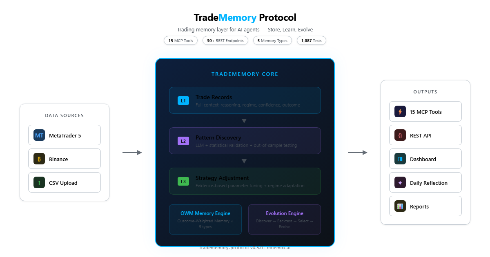
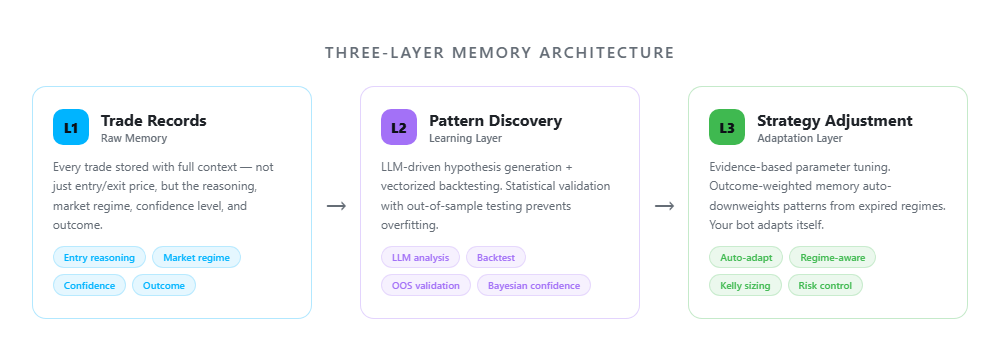
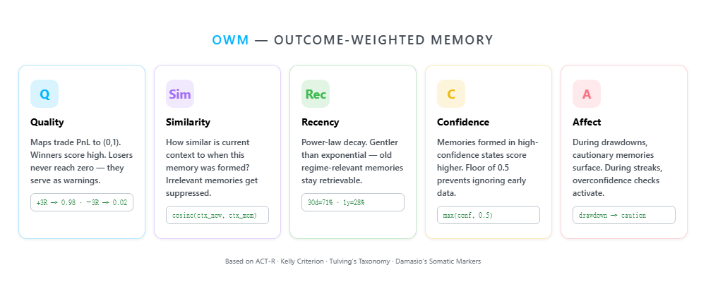
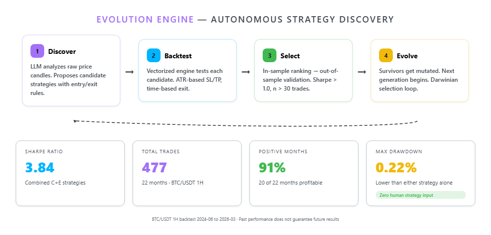

<!-- mcp-name: io.github.mnemox-ai/tradememory-protocol -->

<p align="center">
  
</p>

<div align="center">

[](https://pypi.org/project/tradememory-protocol/)
[](https://github.com/mnemox-ai/tradememory-protocol/actions)
[](https://smithery.ai/server/io.github.mnemox-ai/tradememory-protocol)
[](https://smithery.ai/server/io.github.mnemox-ai/tradememory-protocol)
[](https://opensource.org/licenses/MIT)

[Tutorial](docs/TUTORIAL.md) | [API Reference](docs/API.md) | [OWM Framework](docs/OWM_FRAMEWORK.md) | [中文版](docs/README_ZH.md)

</div>

---

## Architecture

<p align="center">
  
</p>

## Three-Layer Memory

<p align="center">
  
</p>

## Quick Start

```bash
pip install tradememory-protocol
```

Add to `claude_desktop_config.json`:

```json
{
  "mcpServers": {
    "tradememory": {
      "command": "uvx",
      "args": ["tradememory-protocol"]
    }
  }
}
```

Then tell Claude: *"Record my BTCUSDT long at 71,000 — momentum breakout, high confidence."*

<details>
<summary>Claude Code / Cursor / Docker</summary>

```bash
# Claude Code
claude mcp add tradememory -- uvx tradememory-protocol

# From source
git clone https://github.com/mnemox-ai/tradememory-protocol.git
cd tradememory-protocol && pip install -e . && python -m tradememory

# Docker
docker compose up -d
```

</details>

## MCP Tools (15)

| Category | Tools |
|----------|-------|
| **Core Memory** | `store_trade_memory` · `recall_similar_trades` · `get_strategy_performance` · `get_trade_reflection` |
| **OWM Cognitive** | `remember_trade` · `recall_memories` · `get_behavioral_analysis` · `get_agent_state` · `create_trading_plan` · `check_active_plans` |
| **Evolution** | `evolution_run` · `evolution_status` · `evolution_results` · `evolution_compare` · `evolution_config` |

<details>
<summary>REST API (30+ endpoints)</summary>

Trade recording, outcome logging, history, reflections, risk constraints, MT5 sync, OWM, evolution.

Full reference: [docs/API.md](docs/API.md)

</details>

## OWM — Outcome-Weighted Memory

<p align="center">
  
</p>

> Full theoretical foundation: [OWM Framework](docs/OWM_FRAMEWORK.md)

## Evolution Engine

<p align="center">
  
</p>

> Methodology & data: [Research Log](docs/RESEARCH_LOG.md)

## Documentation

| Doc | Description |
|-----|-------------|
| [Architecture](docs/ARCHITECTURE.md) | System design & layer separation |
| [OWM Framework](docs/OWM_FRAMEWORK.md) | Full theoretical foundation |
| [Tutorial](docs/TUTORIAL.md) | Install → first trade → memory recall |
| [API Reference](docs/API.md) | All REST endpoints |
| [MT5 Setup](docs/MT5_SYNC_SETUP.md) | MetaTrader 5 integration |
| [Research Log](docs/RESEARCH_LOG.md) | 11 evolution experiments |
| [Roadmap](docs/ROADMAP.md) | Development roadmap |
| [中文版](docs/README_ZH.md) | Traditional Chinese |

## Contributing

See [Contributing Guide](.github/CONTRIBUTING.md) · [Security Policy](.github/SECURITY.md)

<a href="https://star-history.com/#mnemox-ai/tradememory-protocol&Date">
 <picture>
   <source media="(prefers-color-scheme: dark)" srcset="https://api.star-history.com/svg?repos=mnemox-ai/tradememory-protocol&type=Date&theme=dark" />
   
 </picture>
</a>

---

MIT — see [LICENSE](LICENSE). For educational/research purposes only. Not financial advice.

<div align="center">Built by <a href="https://mnemox.ai">Mnemox</a></div>
