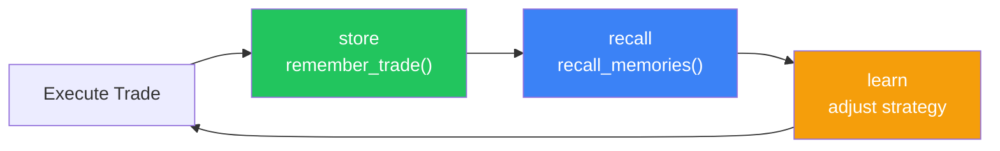
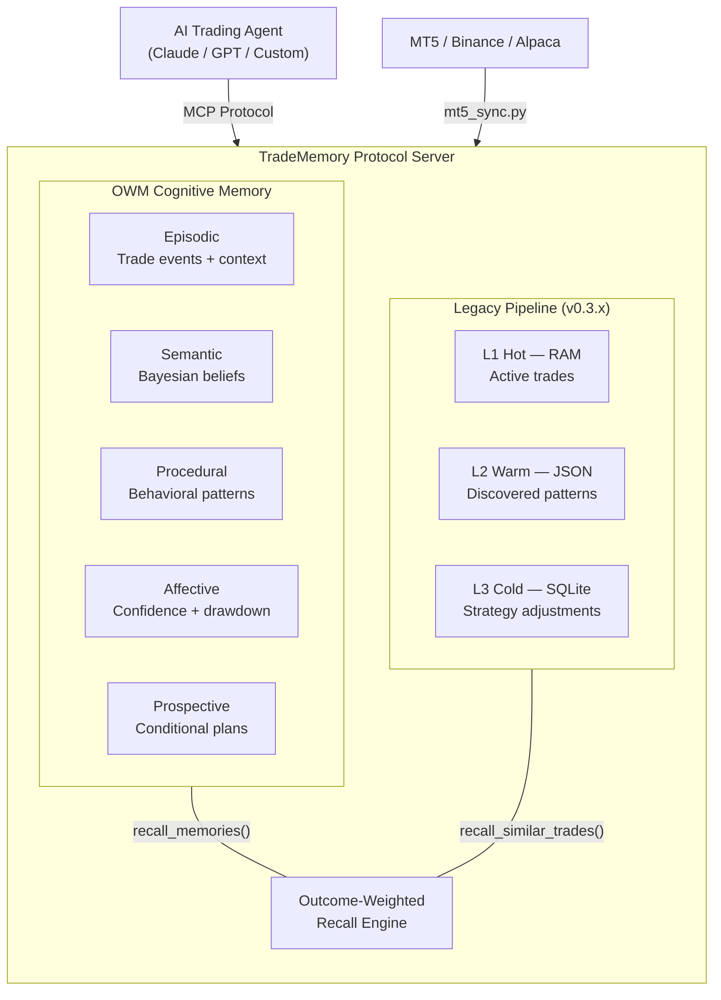

<!-- mcp-name: io.github.mnemox-ai/tradememory-protocol -->
# TradeMemory Protocol

**A [Mnemox](https://mnemox.ai) Project** — MCP server that gives AI trading agents persistent, outcome-weighted memory.

[](https://github.com/mnemox-ai/tradememory-protocol/actions/workflows/ci.yml)
[](https://opensource.org/licenses/MIT)
[](https://www.python.org/downloads/)
[](https://github.com/mnemox-ai/tradememory-protocol)
[](https://codespaces.new/mnemox-ai/tradememory-protocol)

**Works with:** Claude Desktop · Claude Code · Cursor · Windsurf · any MCP client

### The Problem

Your AI trading agent has no memory. Every session starts from zero — same mistakes, same blown setups, no learning.

```
Session 1: Agent loses $200 on Asian session breakouts
Session 2: Agent loses $180 on Asian session breakouts  ← no memory of Session 1
Session 3: Agent loses $210 on Asian session breakouts  ← still no memory
```

### The Fix

```
pip install tradememory-protocol
```

```
Session 1: Agent loses $200 → remember_trade stores context + outcome
Session 2: Agent calls recall_memories → "Asian breakouts: 0% win rate, -$590"
           Agent skips the trade.  ← memory saved $180
```



---

## What It Does

- **Trade journaling** — Records every decision with reasoning, confidence, market context, and outcome
- **Outcome-weighted recall (OWM)** — Five memory types (episodic, semantic, procedural, affective, prospective) scored by `Q × Sim × Rec × Conf × Aff` to surface the right memory at the right time
- **Behavioral bias detection** — Flags overtrading, revenge trading, and disposition effect from your trade history
- **Kelly-from-memory** — Context-weighted position sizing derived from recalled trade outcomes, not global statistics
- **State persistence** — Agent loads its confidence level, drawdown state, behavioral patterns, and active plans when starting a new session
- **Strategy adjustments** — Rule-based tuning from discovered patterns: disable losing strategies, prefer winners, adjust lot sizes, restrict directions

10 MCP tools · 399 tests · MIT license · All v0.3.x features work unchanged

---

## See It Work (30 seconds)

No API key needed. Runs 30 simulated trades through the full pipeline:

```bash
git clone https://github.com/mnemox-ai/tradememory-protocol.git
cd tradememory-protocol
pip install -e .
python scripts/demo.py
```

<details>
<summary>Output — trade recording → pattern discovery → strategy adjustment (click to expand)</summary>

```
── Step 1: Recording trades to memory ──

  # │ Result │ Session │ Strategy    │ P&L      │ R
  1 │ LOSS   │ Asia    │ Pullback    │ $-15.00  │ -1.0
  2 │ WIN    │ London  │ VolBreakout │ $+42.00  │ +2.1
  3 │ WIN    │ London  │ VolBreakout │ $+28.50  │ +1.5
  ...
  30 │ WIN   │ London  │ Pullback    │ $+28.00  │ +1.4

  Total: 30 trades | Winners: 19 | Win rate: 63% | Net P&L: $+499.50

── Step 2: Reflection engine discovers patterns ──

  Pattern             │ Win Rate │ Record    │ Net P&L   │ Assessment
  London session      │     100% │ 14W / 0L  │ $+608.50  │ HIGH EDGE
  Asian session       │      10% │  1W / 9L  │ $-156.00  │ WEAK
  VolBreakout strategy│      73% │ 11W / 4L  │ $+429.50  │ HIGH EDGE

── Step 3: Strategy adjustments generated ──

  Parameter                │ Old  │ New  │ Reason
  london_max_lot           │ 0.05 │ 0.08 │ London WR 100% — earned more room
  asian_max_lot            │ 0.05 │ 0.025│ Asian WR 10% — reduce exposure
  min_confidence_threshold │ 0.40 │ 0.55 │ Trades below 0.55 have 0% WR
```

</details>

> All demo data is simulated. See [Before/After Comparison](docs/BEFORE_AFTER.md) for detailed breakdown.

---

## Quick Start

### Claude Desktop

Add to your `claude_desktop_config.json`:

```json
{
  "mcpServers": {
    "tradememory": {
      "command": "uvx",
      "args": ["tradememory-protocol"]
    }
  }
}
```

<details>
<summary>Config file location</summary>

- **macOS:** `~/Library/Application Support/Claude/claude_desktop_config.json`
- **Windows:** `%APPDATA%\Claude\claude_desktop_config.json`

</details>

Restart Claude Desktop. You'll see TradeMemory tools in the 🔨 menu. Try asking:

- *"Store my latest XAUUSD trade: long 0.05 lots, entry 2847, exit 2855, profit $40"*
- *"Show my trading performance this week"*
- *"Run a reflection on my last 20 trades"*

### Claude Code

```bash
claude mcp add tradememory -- uvx tradememory-protocol
```

Then ask Claude:

- *"What patterns do you see in my recent losing trades?"*
- *"Compare my London session vs Asian session win rates"*

### Cursor / Other MCP Clients

Add to `.cursor/mcp.json` (or your client's MCP config):

```json
{
  "mcpServers": {
    "tradememory": {
      "command": "uvx",
      "args": ["tradememory-protocol"]
    }
  }
}
```

### From Source

```bash
git clone https://github.com/mnemox-ai/tradememory-protocol.git
cd tradememory-protocol
pip install -e .
```

### Start the Server

```bash
python -m src.tradememory.server
# Runs on http://localhost:8000
```

### Docker

```bash
docker compose up -d

# Or manually:
docker build -t tradememory .
docker run -p 8000:8000 -e ANTHROPIC_API_KEY=your-key tradememory
```

### As OpenClaw Skill

Give your OpenClaw agent trading memory:

```
Install this skill: https://github.com/mnemox-ai/tradememory-protocol
```

Then tell your agent via WhatsApp:
- *"Record my XAUUSD trade: long 0.05 lots, +$40 profit"*
- *"Show my trading performance this week"*
- *"Run a reflection on my last 20 trades"*

See [.skills/tradememory/SKILL.md](.skills/tradememory/SKILL.md) for the full skill reference.

### Tutorials

- [English Tutorial](docs/TUTORIAL.md) — Step-by-step from install to using memory in trades
- [中文教學](docs/TUTORIAL_ZH.md) — 完整教學指南

---

## Architecture



> **Legacy compatibility:** All v0.3.x tools and data remain functional. `recall_similar_trades` auto-detects whether OWM episodic data exists — if yes, it uses outcome-weighted scoring; if no, it falls back to keyword matching. Zero migration required.

---

## Why OWM?

Outcome-Weighted Memory is a novel application of established cognitive science to AI trading agents — not an invention of new theory. It combines Tulving's episodic memory taxonomy (1972), Anderson's ACT-R activation framework (2007), Kelly's optimal bet sizing (1956), and Damasio's somatic marker hypothesis (1994) into a single recall function purpose-built for sequential financial decisions.

The core recall formula scores each candidate memory `m` given current context `C`:

```
Score(m, C) = Q(m) × Sim(m, C) × Rec(m) × Conf(m) × Aff(m)
```

| Component | Formula | What It Does |
|-----------|---------|-------------|
| **Q** — Outcome Quality | `sigmoid(k · pnl_r / σ_r)` | Maps R-multiple outcomes to (0,1) via sigmoid. A +3R winner scores 0.98; a -3R loser scores 0.02 but never zero — losing memories are recalled as warnings. |
| **Sim** — Context Similarity | Gaussian kernel over `ContextVector` | Measures how similar the current market context (symbol, regime, ATR, session) is to when the memory was formed. Irrelevant memories are suppressed. |
| **Rec** — Recency | `(1 + age_days/τ)^(-d)` | ACT-R power-law decay. A 30-day-old memory retains 70.7% strength; a 1-year-old memory retains 27.5%. Much gentler than exponential — old regime-relevant memories remain retrievable. |
| **Conf** — Confidence | `0.5 + 0.5 · confidence` | Memories formed during high-confidence states score higher. Floor of 0.5 prevents early memories from being ignored. |
| **Aff** — Affective Modulation | `1.0 + α · relevance(m, state)` | Current drawdown/streak state modulates recall. During drawdowns, cautionary memories surface; during winning streaks, overconfidence checks activate. |

**Academic foundations:**
- Anderson, J. R. (2007). *How Can the Human Mind Occur in the Physical Universe?* — ACT-R activation and power-law decay
- Kelly, J. L. (1956). *A New Interpretation of Information Rate* — Optimal bet sizing from outcome history
- Tulving, E. (1972). *Episodic and semantic memory* — Five-type memory taxonomy
- Damasio, A. (1994). *Descartes' Error* — Affective markers in decision-making

Full specification: [docs/OWM_FRAMEWORK.md](docs/OWM_FRAMEWORK.md) (1,875 lines, includes mathematical proofs, boundary analysis, and financial validation against Kelly/Bayesian/Prospect Theory)

---

## MCP Tools (v0.4.0)

### Core Memory Tools (4 — backward compatible)

| Tool | Description |
|------|-------------|
| `store_trade_memory` | Store a trade decision with full context into memory |
| `recall_similar_trades` | Find past trades with similar market context (auto-upgrades to OWM when episodic data exists) |
| `get_strategy_performance` | Aggregate performance stats per strategy |
| `get_trade_reflection` | Deep-dive into a specific trade's reasoning and lessons |

### OWM Tools (6 — new in v0.4.0)

| Tool | Description |
|------|-------------|
| `remember_trade` | Store a trade into all five memory layers simultaneously (episodic + Bayesian semantic update + procedural running averages + affective EWMA) |
| `recall_memories` | Outcome-weighted recall with full score breakdown per component |
| `get_behavioral_analysis` | Procedural memory analysis: hold times, disposition ratio, lot sizing variance, Kelly comparison |
| `get_agent_state` | Current affective state: confidence, risk appetite, drawdown %, win/loss streaks, recommended action |
| `create_trading_plan` | Store a conditional plan in prospective memory (e.g., "if regime changes to ranging, skip breakout trades") |
| `check_active_plans` | Match active plans against current market context, expire stale plans |

### REST API

- `POST /trade/record_decision` — Log entry decision with full context
- `POST /trade/record_outcome` — Log trade result (P&L, exit reason)
- `POST /trade/query_history` — Search past trades by strategy/date/result
- `POST /reflect/run_daily` — Trigger daily summary (rule-based, or LLM with API key)
- `POST /reflect/run_weekly` — Weekly deep reflection
- `POST /reflect/run_monthly` — Monthly reflection
- `POST /risk/get_constraints` — Dynamic risk parameters
- `POST /risk/check_trade` — Validate trade against constraints
- `POST /mt5/sync` — Sync trades from MetaTrader 5
- `POST /reflect/generate_adjustments` — Generate L3 strategy adjustments from L2 patterns
- `GET /adjustments/query` — Query strategy adjustments by status/type
- `POST /adjustments/update_status` — Update adjustment lifecycle (proposed→approved→applied)
- 7 new OWM endpoints under `/owm/` prefix — episodic/semantic/procedural/affective/prospective CRUD + recall + Kelly sizing

Full API reference: [docs/API.md](docs/API.md)

---

## Project Status

### What Works (v0.4.0)
- OWM cognitive memory architecture (5 memory types, outcome-weighted recall, Kelly sizing)
- 10 MCP tools + 20+ REST API endpoints
- MT5 connector (`scripts/mt5_sync.py`) — auto-sync trades from MetaTrader 5
- Binance connector (`scripts/binance_sync.py`) — poll and sync spot trades
- Daily/weekly/monthly reflection engine (rule-based + optional LLM)
- State persistence (cross-session memory)
- Streamlit dashboard
- 399 unit tests passing
- Interactive demo (`demo.py`)

### Planned
- Multi-strategy portfolio support
- Agent-to-agent learning
- More exchange connectors (Bybit, Alpaca, Interactive Brokers)

---

## Technical Stack

- **MCP Server:** FastMCP 3.x (stdio transport)
- **REST API:** FastAPI + uvicorn
- **Storage:** SQLite (trade records + OWM tables), JSON (L2)
- **Memory:** OWM 5-type cognitive memory with outcome-weighted recall
- **Reflection:** Rule-based pattern analysis, optional Claude API for deeper insights
- **Broker Integration:** MT5 Python API, Binance REST API
- **Dashboard:** Streamlit + Plotly
- **Testing:** pytest (399 tests)

---

## Documentation

- [OWM Framework Specification](docs/OWM_FRAMEWORK.md) — Full theoretical foundation (1,875 lines)
- [Tutorial (English)](docs/TUTORIAL.md)
- [教學 (中文)](docs/TUTORIAL_ZH.md)
- [Before/After Comparison](docs/BEFORE_AFTER.md) — Simulated impact data
- [Quick Start Guide](docs/QUICK_START.md)
- [Architecture Overview](docs/ARCHITECTURE.md)
- [API Reference](docs/API.md)
- [Data Schema](docs/SCHEMA.md)
- [Reflection Report Format](docs/REFLECTION_FORMAT.md)
- [MT5 Setup Guide](docs/MT5_SYNC_SETUP.md)
- [Daily Reflection Setup](docs/DAILY_REFLECTION_SETUP.md)

---

## Connect to MT5 (Optional)

Sync live trades from MetaTrader 5 into TradeMemory automatically.

### Prerequisites

1. **MetaTrader 5** running with your broker account
2. **Python 3.12** (system Python 3.13+ is not supported by the MT5 package)
3. **Enable API access** in MT5: `Tools → Options → Expert Advisors → Allow Algo Trading`
   - Also set `Api=1` in `common.ini` under `[Experts]` section

### Quick Start

```bash
# 1. Install dependencies
pip install MetaTrader5 python-dotenv requests fastapi uvicorn pydantic

# 2. Configure .env
cp .env.example .env
# Edit .env with your MT5 credentials

# 3. Start both services
scripts/start_services.bat
```

### Auto-Start on Login (Windows)

```bash
# Run as Administrator:
scripts\install_autostart.bat
```

This registers a Windows Task Scheduler task that starts the tradememory server and `scripts/mt5_sync.py` 30 seconds after login.

```
scripts/
├── start_services.bat       # Start tradememory server + mt5_sync.py
├── stop_services.bat        # Stop all services
├── install_autostart.bat    # Register auto-start task (run as admin)
└── TradeMemory_AutoStart.xml # Task Scheduler config
```

### Manual Start

```bash
# Terminal 1: Start API server
python -c "import sys; sys.path.insert(0, 'src'); from tradememory.server import main; main()"
# Runs on http://localhost:8000

# Terminal 2: Start MT5 sync (scans every 60s)
python scripts/mt5_sync.py
```

### Daily Reflection

```bash
# Windows: Import start_daily_reflection.bat into Task Scheduler (23:55 daily)
# Linux/Mac: 55 23 * * * /path/to/daily_reflection.sh
```

See [MT5 Setup Guide](docs/MT5_SYNC_SETUP.md) for detailed configuration.

---

## FAQ

**Does TradeMemory connect directly to my broker?**
No. TradeMemory is a memory layer, not a trading platform connector. It accepts standardized trade data from any source. For MT5 users, `scripts/mt5_sync.py` automatically polls and syncs closed trades every 60 seconds.

**What trading platforms are supported?**
Any platform that can output trade data. Built-in connectors: MetaTrader 5 (`scripts/mt5_sync.py`) and Binance spot (`scripts/binance_sync.py`). For other platforms (Alpaca, Interactive Brokers), send trades through the MCP `remember_trade` tool or REST API.

**What data does it store?**
Five memory types: **Episodic** (individual trade events with full context), **Semantic** (Bayesian beliefs about strategy effectiveness, updated with each trade), **Procedural** (behavioral patterns — hold times, disposition ratio, lot sizing variance), **Affective** (agent confidence, drawdown state, win/loss streaks), and **Prospective** (conditional trading plans). Plus the legacy L1/L2/L3 layers for backward compatibility.

**Is it free to use?**
Yes. MIT license, fully open source. All 10 MCP tools work without any API keys. The optional LLM reflection feature requires a Claude API key for deeper insights, but the core memory system — including OWM recall and Kelly sizing — runs entirely locally.

**Can I use it without MetaTrader 5?**
Yes. MT5 is just one data source. You can manually store trades via the MCP `store_trade_memory` or `remember_trade` tools, send them through the REST API, or write a custom sync script for your platform.

---

## Research

We used TradeMemory's episodic memory system to run controlled A/B experiments on LLM trading agents. Key finding: naively adding memory made the agent *worse* (Profit Factor 2.42 → 0.94) due to positive recall bias — the same cognitive bias documented in human investors.

**[I Gave My Trading Agent Memory. It Made Everything Worse. Here's How I Fixed It.](https://medium.com/@seanpeng-mnemox/i-gave-my-trading-agent-memory-it-made-everything-worse-heres-how-i-fixed-it-955ed2495c2e)**

The full experiment was conducted using the [Trade Dreaming](https://github.com/mnemox-ai/trade-dreaming) replay engine built on top of this protocol.

---

## Contributing

See [CONTRIBUTING.md](CONTRIBUTING.md) for guidelines.

- Star the repo to follow progress
- Report bugs via [GitHub Issues](https://github.com/mnemox-ai/tradememory-protocol/issues)
- Submit PRs for bug fixes or new features
- Join the discussion in [Discussions](https://github.com/mnemox-ai/tradememory-protocol/discussions)

---

## License

MIT — see [LICENSE](LICENSE).

---

## Disclaimer

This software is for **educational and research purposes only**. It does not constitute financial advice. Trading involves substantial risk of loss. You are solely responsible for your trading decisions. The authors accept no liability for losses incurred through use of this software.

---

## Contact

- [GitHub Issues](https://github.com/mnemox-ai/tradememory-protocol/issues)
- [GitHub Discussions](https://github.com/mnemox-ai/tradememory-protocol/discussions)

---

Built by [Mnemox](https://mnemox.ai)
