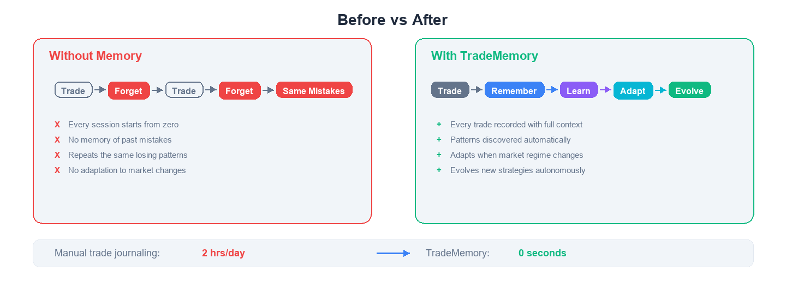
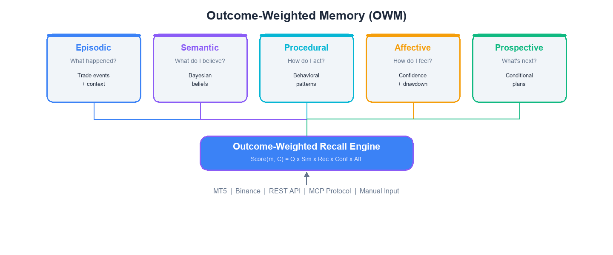

<!-- mcp-name: io.github.mnemox-ai/tradememory-protocol -->

<div align="center">

<picture>
  <source media="(prefers-color-scheme: dark)" srcset="assets/hero-dark.png">
  
</picture>


**What if your trading bot could learn from every mistake — and invent better strategies by itself?**

200+ trading MCP servers execute trades. None of them remember what happened.

TradeMemory is the memory layer that changes that.

[](https://pypi.org/project/tradememory-protocol/)
[](https://github.com/mnemox-ai/tradememory-protocol/actions)
[](https://smithery.ai/server/io.github.mnemox-ai/tradememory-protocol)
[](https://opensource.org/licenses/MIT)
[](https://smithery.ai/server/io.github.mnemox-ai/tradememory-protocol)

</div>

---

<!-- Before / After comparison -->

<div align="center">

<picture>
  <source media="(prefers-color-scheme: dark)" srcset="assets/before-after-dark.png">
  
</picture>


</div>

---

## Why TradeMemory?

**"Why does my bot keep making the same mistakes?"**

Persistent memory records every trade with full context — entry reasoning, market regime, confidence level, outcome. Pattern discovery finds what you can't see manually.

**"My strategy worked for months, then suddenly stopped."**

Outcome-weighted recall auto-downweights patterns from old regimes. Your bot adapts without you rewriting a single rule.

**"How do I know it's not just overfitting?"**

Every pattern carries Bayesian confidence + sample size. Built-in out-of-sample validation. Suspicious patterns get flagged, not blindly followed.

**"I just want it to figure out what works."**

Evolution Engine: feed raw price data. No indicators, no hand-written rules. It discovers, backtests, eliminates, and evolves — autonomously.

> 22 months of BTC data. **Sharpe 3.84.** 477 trades. 91% positive months. Zero human strategy input.

---

## Quick Start

```bash
pip install tradememory-protocol
```

Add to your Claude Desktop config (`claude_desktop_config.json`):

```json
{
  "mcpServers": {
    "tradememory": {
      "command": "uvx",
      "args": ["tradememory-protocol"]
    }
  }
}
```

Then say to Claude:

> *"Record my BTCUSDT long at 71,000 — momentum breakout, high confidence."*

<details>
<summary>Claude Code / Cursor / Other MCP clients</summary>

**Claude Code:**
```bash
claude mcp add tradememory -- uvx tradememory-protocol
```

**Cursor / Windsurf / any MCP client** — add to your MCP config:
```json
{
  "mcpServers": {
    "tradememory": {
      "command": "uvx",
      "args": ["tradememory-protocol"]
    }
  }
}
```

</details>

<details>
<summary>From source / Docker</summary>

```bash
git clone https://github.com/mnemox-ai/tradememory-protocol.git
cd tradememory-protocol
pip install -e .
python -m tradememory
# Server runs on http://localhost:8000
```

```bash
docker compose up -d
```

</details>

<details>
<summary>Claude Plugin (commands + skills + domain knowledge)</summary>

```bash
git clone https://github.com/mnemox-ai/tradememory-plugin.git
claude --plugin-dir ./tradememory-plugin
```

Adds 5 slash commands (`/record-trade`, `/recall`, `/performance`, `/evolve`, `/daily-review`) and 3 domain knowledge skills. See [tradememory-plugin](https://github.com/mnemox-ai/tradememory-plugin) for details.

</details>

---

## Use Cases

**Crypto** — Feed BTC/ETH trades from Binance. The Evolution Engine discovers timing patterns you'd never find manually. Auto-adapts when market regime shifts.

**Forex + MT5** — Auto-sync every closed trade from MetaTrader 5. Persistent memory across sessions means your EA remembers that Asian session breakouts have a 10% win rate — and stops taking them.

**Developers** — Build memory-aware trading agents with 15 MCP tools + 30 REST endpoints. Your agent starts each session knowing its confidence level, active plans, and which strategies are working.

---

## Architecture

<div align="center">

<picture>
  <source media="(prefers-color-scheme: dark)" srcset="assets/owm-architecture-dark.png">
  
</picture>


</div>

Every memory is scored by five factors when recalled:

| Factor | What It Does |
|--------|-------------|
| **Q** — Quality | Maps trade outcomes to (0,1). A +3R winner scores 0.98. A -3R loser scores 0.02 — but never zero, because losing memories are recalled as warnings. |
| **Sim** — Similarity | How similar is the current market context to when the memory was formed? Irrelevant memories get suppressed. |
| **Rec** — Recency | Power-law decay. 30-day memory retains 71% strength. 1-year memory retains 28%. Gentler than exponential — regime-relevant old memories stay retrievable. |
| **Conf** — Confidence | Memories formed in high-confidence states score higher. Floor of 0.5 prevents early memories from being ignored. |
| **Aff** — Affect | During drawdowns, cautionary memories surface. During winning streaks, overconfidence checks activate. |

> Based on ACT-R (Anderson 2007), Kelly criterion (1956), Tulving's memory taxonomy (1972), and Damasio's somatic markers (1994). Full spec: [OWM_FRAMEWORK.md](docs/OWM_FRAMEWORK.md)

---

<details>
<summary><strong>Evolution Engine — the hidden ace</strong></summary>

The Evolution Engine discovers trading strategies from raw price data. No indicators. No human rules. Pure LLM-driven hypothesis generation + vectorized backtesting + Darwinian selection.

### How it works

1. **Discover** — LLM analyzes price data, proposes candidate strategies
2. **Backtest** — Vectorized engine tests each candidate (ATR-based SL/TP, long/short, time-based exit)
3. **Select** — In-sample rank → out-of-sample validation (Sharpe > 1.0, trades > 30, max DD < 20%)
4. **Evolve** — Survivors get mutated. Next generation. Repeat.

### Results: BTC/USDT 1H, 22 months (2024-06 to 2026-03)

| System | Trades | Win Rate | RR | Profit Factor | Sharpe | Return | Max DD |
|--------|--------|----------|----|---------------|--------|--------|--------|
| Strategy C (SHORT) | 157 | 42.7% | 1.57 | 1.17 | 0.70 | +0.37% | 0.45% |
| Strategy E (LONG) | 320 | 49.4% | 1.95 | 1.91 | 4.10 | +3.65% | 0.27% |
| **C+E Combined** | **477** | **47.2%** | **1.84** | **1.64** | **3.84** | **+4.04%** | **0.22%** |

- 91% positive months (20 of 22)
- Max drawdown 0.22% — lower than either strategy alone
- Zero human strategy input. The LLM discovered these from raw candles.

> Data from [RESEARCH_LOG.md](docs/RESEARCH_LOG.md). 11 experiments, full methodology, model comparison (Haiku vs Sonnet vs Opus).

</details>

---

## MCP Tools

### Core Memory (4 tools)
| Tool | Description |
|------|-------------|
| `store_trade_memory` | Store a trade with full context |
| `recall_similar_trades` | Find past trades with similar market context (auto-upgrades to OWM when available) |
| `get_strategy_performance` | Aggregate stats per strategy |
| `get_trade_reflection` | Deep-dive into a trade's reasoning and lessons |

### OWM Cognitive Memory (6 tools)
| Tool | Description |
|------|-------------|
| `remember_trade` | Store into all five memory layers simultaneously |
| `recall_memories` | Outcome-weighted recall with full score breakdown |
| `get_behavioral_analysis` | Hold times, disposition ratio, Kelly comparison |
| `get_agent_state` | Current confidence, risk appetite, drawdown, streaks |
| `create_trading_plan` | Conditional plans in prospective memory |
| `check_active_plans` | Match plans against current context |

### Evolution Engine (5 tools)
| Tool | Description |
|------|-------------|
| `evolution_run` | Run a full discover → backtest → select cycle |
| `evolution_status` | Check progress of running evolution |
| `evolution_results` | Get graduated strategies with full metrics |
| `evolution_compare` | Compare generations side by side |
| `evolution_config` | View/update evolution parameters |

<details>
<summary>REST API (30+ endpoints)</summary>

Trade recording, outcome logging, history queries, daily/weekly/monthly reflections, risk constraints, MT5 sync, OWM CRUD, evolution orchestration, and more.

Full reference: [docs/API.md](docs/API.md)

</details>

---

## Star History

<a href="https://star-history.com/#mnemox-ai/tradememory-protocol&Date">
 <picture>
   <source media="(prefers-color-scheme: dark)" srcset="https://api.star-history.com/svg?repos=mnemox-ai/tradememory-protocol&type=Date&theme=dark" />
   
 </picture>
</a>

---

## Contributing

See [CONTRIBUTING.md](.github/CONTRIBUTING.md) for guidelines.

- Star the repo to follow progress
- Report bugs via [GitHub Issues](https://github.com/mnemox-ai/tradememory-protocol/issues)
- Submit PRs for bug fixes or new features

---

## Documentation

| Doc | Description |
|-----|-------------|
| [OWM Framework](docs/OWM_FRAMEWORK.md) | Full theoretical foundation (1,875 lines) |
| [Tutorial (EN)](docs/TUTORIAL.md) | Step-by-step from install to using memory |
| [Tutorial (中文)](docs/TUTORIAL_ZH.md) | 完整教學指南 |
| [API Reference](docs/API.md) | All REST endpoints |
| [MT5 Setup](docs/MT5_SYNC_SETUP.md) | MetaTrader 5 integration |
| [Research Log](docs/RESEARCH_LOG.md) | 11 evolution experiments with full data |

---

## License

MIT — see [LICENSE](LICENSE).

**Disclaimer:** This software is for educational and research purposes only. It does not constitute financial advice. Trading involves substantial risk of loss.

---

<div align="center">

Built by [Mnemox](https://mnemox.ai)

</div>
