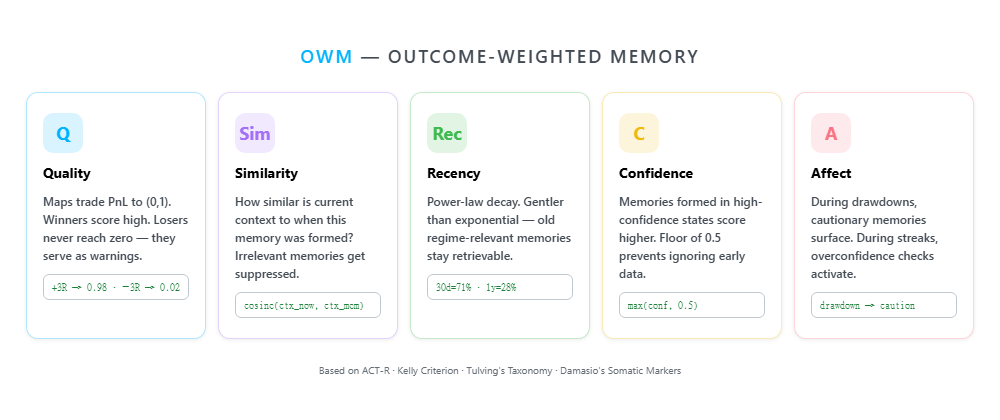

<!-- mcp-name: io.github.mnemox-ai/tradememory-protocol -->

<p align="center">
  
</p>

<div align="center">

[](https://pypi.org/project/tradememory-protocol/)
[](https://github.com/mnemox-ai/tradememory-protocol/actions/workflows/ci.yml)
[](https://smithery.ai/server/mnemox-ai/tradememory-protocol)
[](https://smithery.ai/server/mnemox-ai/tradememory-protocol)
[](https://opensource.org/licenses/MIT)

[Getting Started](docs/GETTING_STARTED.md) | [Use Cases](docs/USE_CASES.md) | [API Reference](docs/API.md) | [OWM Framework](docs/OWM_FRAMEWORK.md) | [Limitations](LIMITATIONS.md) | [中文版](docs/README_ZH.md)

</div>

---

> **Project status (October 2026):** the memory layer is in **maintenance mode** — bug and security reports are reviewed, no new memory features are planned. Active work is the [broker proxy](#put-a-brake-in-front-of-your-broker-preview) below. For paid work, see [Trading Record Analysis](#trading-record-analysis).

**Your trading AI has amnesia. Brokers just opened the door to it anyway.**

It makes the same mistakes every session. It can't explain why it traded. It forgets everything when the context window ends. In 2026 Robinhood, Alpaca and Interactive Brokers opened MCP endpoints for trading agents, and Robinhood's support page says it is not responsible for losses from agent-generated decisions. Each broker shows you its own activity feed. None gives your agent a memory, none puts a brake you control in front of the order, and none of those records travel with you to the next broker or the next framework.

The AI trading stack is missing a layer. Every MCP server handles execution — placing orders, fetching prices, reading charts. **None handle memory.**

Your agent can buy 100 shares of AAPL but can't answer: *"What happened last time I bought AAPL in this condition?"*

**TradeMemory is the memory layer.** One `pip install`, and your AI agent remembers every trade, every outcome, every mistake — with a SHA-256 tamper-evident audit trail.

Used by an independent trader running a pre-flight checklist before every position, and first-party against an MT5 account that logs blocked signals as well as executed ones. See USE_CASES.md for which is which.

## What it does

- **Before trading:** ask your memory — what happened last time in this market condition? How did it end?
- **After trading:** one call records everything — five memory layers update automatically
- **Safety rails:** confidence tracking, drawdown alerts, losing streak detection — the system tells you when to stop

Works with any market (stocks, forex, crypto, futures), any broker, any AI platform. TradeMemory doesn't execute trades or touch your money — it only records and recalls.

## Put a brake in front of your broker (preview)

The `proxy` extra runs TradeMemory *between* your agent and your broker's MCP server. Every tool is forwarded unchanged, except order-placing tools, which are evaluated by [Mnemox Control](https://github.com/mnemox-ai/mnemox-control) against a policy you own before they reach the broker. Every evaluation, allowed or refused, is recorded and chained into the audit log, and the memory fills itself from the orders that pass. The agent you already have keeps working; only one line of its MCP config changes.

```bash
# until the next release ships the extra:
pip install "tradememory-protocol[proxy] @ git+https://github.com/mnemox-ai/tradememory-protocol@feat/broker-proxy"   # Python 3.12+
tradememory proxy init --account-id <your Alpaca account id> --symbols AAPL,MSFT
tradememory proxy doctor --env-file ~/.secrets/alpaca-paper.env   # checks the live tool names and the account id
tradememory proxy config                                           # prints the MCP client entry that replaces the direct Alpaca one
```

Refused by default: symbols outside your list, orders above your notional and position limits, entries without a bracket stop, any new order after your daily-loss or drawdown limit, cancelling the protective stop of an open position, any tool the brake has not classified, and everything while you have run `tradememory proxy halt FULL_HALT`. Never blocked: closing a position. Orders at or above `approval_notional` wait for `tradememory proxy approve <intent_id>`; the agent retries with the same `client_order_id` and the same terms, and the proxy forwards it exactly once. Anything the brake cannot evaluate (a dead quote feed, an unknown asset, an order type policy v0 does not cover) is refused, not passed through.

Status: tested end-to-end against a stateful fake of Alpaca's MCP server (`tests/proxy/`), and run once against a real Alpaca paper account on 2026-10-01: three refusals (symbol not on the list, entry without a stop, notional over the limit), one allowed one-share bracket order that reached the broker, and one retry with the same `client_order_id` that was answered from the record without a second order. The fake's argument names and payload shapes were corrected from that live run; `doctor` re-checks them against your account. Options, order replacement, stop-limit and trailing orders are refused rather than evaluated. Broker keys go only to the broker process the proxy starts; the proxy never stores them.

Walkthrough with the real outputs: [docs/recipes/alpaca-brake.md](docs/recipes/alpaca-brake.md). **Running an agent against a broker and want this in front of it?** [Open a brake-integration issue](https://github.com/mnemox-ai/tradememory-protocol/issues/new?template=brake_integration.yml) or [book 30 minutes](https://calendly.com/johnson90207/30min). The first ten setups get hands-on help at no charge, and they decide what gets built next.

## See the interface

**[tradememory-dashboard.onrender.com](https://tradememory-dashboard.onrender.com)** — the dashboard running on an illustrative demo dataset. Nothing to install.

It is an interface preview, not a track record: the trades are synthetic and every figure on it is labelled as such. For what the memory layer actually does in a terminal, `pip install tradememory-protocol && tradememory demo --fast` replays 30 trades and shows the recall and parameter adjustment it derives from them.

## Quick Start

```bash
pip install tradememory-protocol
```

Add to Claude Desktop (`claude_desktop_config.json`):

```json
{
  "mcpServers": {
    "tradememory": {
      "command": "uvx",
      "args": ["tradememory-protocol"]
    }
  }
}
```

Then tell Claude: *"Record my AAPL long at $195 — earnings beat, institutional buying, high confidence."*

<details>
<summary>Claude Code / Cursor / Docker</summary>

```bash
# Claude Code
claude mcp add tradememory -- uvx tradememory-protocol

# From source
git clone https://github.com/mnemox-ai/tradememory-protocol.git
cd tradememory-protocol && pip install -e . && python -m tradememory

# Docker
docker compose up -d
```

</details>

**Full walkthrough:** [Getting Started](docs/GETTING_STARTED.md) (Trader Track + Developer Track)

## Who uses TradeMemory

| | US Equity Trader | Forex EA System | Compliance Team |
|---|---|---|---|
| **Market** | Stocks (AAPL, TSLA, ...) | XAUUSD (Gold) | Multi-asset |
| **How** | Pre-flight checklist before every trade | Automated sync from MT5 | Full decision audit trail |
| **Key value** | Discipline system — memory before every decision | Record why signals were blocked, not just executed | SHA-256 tamper-evident records for regulators |
| **Details** | [Read more →](docs/USE_CASES.md#case-1-us-equity-trader--pre-flight-workflow) | [Read more →](docs/USE_CASES.md#case-2-forex-ea-system--automated-memory-loop) | [Read more →](docs/USE_CASES.md#case-3-compliance-first-fund--audit-trail) |

## How it works

<p align="center">
  
</p>

1. **Recall** — Before trading, retrieve past trades weighted by outcome quality, context similarity, recency, confidence, and emotional state ([OWM Framework](docs/OWM_FRAMEWORK.md))
2. **Record** — After trading, one call to `remember_trade` writes to five memory layers: episodic, semantic, procedural, affective, and trade records
3. **Reflect** — Daily/weekly/monthly reviews detect behavioral drift, strategy decay, and trading mistakes
4. **Audit** — Every decision is SHA-256 hashed at creation. Export anytime for review or regulatory submission

### MCP Tools

| Category | Tools | Description |
|----------|-------|-------------|
| **Memory** | `remember_trade` · `recall_memories` | Record and recall trades with outcome-weighted scoring |
| **State** | `get_agent_state` · `get_behavioral_analysis` | Confidence, drawdown, streaks, behavioral patterns |
| **Planning** | `create_trading_plan` · `check_active_plans` | Prospective plans with conditional triggers |
| **Risk** | `check_trade_legitimacy` | 5-factor pre-trade gate (full / reduced / skip) |
| **Audit** | `export_audit_trail` · `verify_audit_hash` | SHA-256 tamper detection + bulk export |

<details>
<summary>All 20 MCP tools + REST API</summary>

| Category | Tools |
|----------|-------|
| **Core Memory** | `get_strategy_performance` · `get_trade_reflection` |
| **OWM Cognitive** | `remember_trade` · `recall_memories` · `get_behavioral_analysis` · `get_agent_state` · `create_trading_plan` · `check_active_plans` |
| **Risk & Governance** | `check_trade_legitimacy` · `validate_strategy` · `compute_dqs` |
| **Evolution** | `evolution_fetch_market_data` · `evolution_discover_patterns` · `evolution_run_backtest` · `evolution_evolve_strategy` · `evolution_get_log` |
| **Audit** | `export_audit_trail` · `verify_audit_hash` · `verify_audit_chain` · `get_daily_root` |

**REST API:** 35+ endpoints for trade recording, reflections, risk, MT5 sync, OWM, evolution, and audit. [Full reference →](docs/API.md)

</details>

## Trading Record Analysis

TradeMemory itself is free and self-hosted. What the maintainer offers as a paid service is **statistical analysis of your own trading records**: export your MT4/MT5 history and get a descriptive-statistics report — where your losses concentrate, how your position sizing changes after losses, forced-liquidation structure, and the actual risk you took per trade — followed by a walkthrough call.

Descriptive statistics of past trades only: no trade signals, no investment advice, no performance promises. Your files are deleted after delivery.

[dev@mnemox.ai](mailto:dev@mnemox.ai) | [Book a call](https://calendly.com/johnson90207/30min)

## Enterprise & Compliance

Every trading decision your agent makes — including decisions **not** to trade — is recorded as a Trading Decision Record (TDR). Per-record SHA-256 content hashes are linked into a forward-chained audit ledger; every UTC day is summarised by a Merkle root which itself chains across days. Tampering with any historical record invalidates every subsequent link.

These obligations bind investment firms, not retail users. Under the EU AI Act, the Annex III high-risk logging obligations were postponed to 2 December 2027, and ESMA's February 2026 supervisory briefing on algorithmic trading states that AI-based algorithmic trading is currently excluded from the high-risk scope. The table shows which TradeMemory features map to those texts if and when they apply to you. It is not a compliance claim.

| Regulation | Requirement | TradeMemory Coverage |
|------------|-------------|---------------------|
| MiFID II Article 17 | Record every algorithmic trading decision factor | Full decision chain: conditions, filters, indicators, execution |
| EU AI Act Article 14 | Human oversight of high-risk AI systems | Explainable reasoning + memory context for every decision |
| EU AI Act Article 12 | Automatic, tamper-resistant logs over system lifetime | Linked SHA-256 chain + daily Merkle roots (RFC 3161 TSA anchoring, on by default since 0.5.3) |

```bash
# Verify a single record hasn't been tampered with
verify_audit_hash(trade_id="MT5-7047640363")
# → {"verified": true, "chain_entry": {"sequence_num": 42, ...}}

# Walk the entire chain (or a slice) end-to-end
verify_audit_chain(from_seq=1, to_seq=None)
# → {"verified": true, "checked_count": 1284, "first_break_at": null}

# Daily Merkle root — single 32-byte anchor over every TDR for that day
get_daily_root(date="2026-05-14")
# → {"verified": true, "root_hash": "a05544...", "record_count": 18}

# Bulk export for regulatory submission
GET /audit/export?strategy=VolBreakout&start=2026-03-01&format=jsonl
```

See [LIMITATIONS.md](LIMITATIONS.md) for the full audit-chain maturity statement, including what's not in v0.5.2 yet (TSA timestamping, external anchoring, zkML proof of inference).

**Need a custom deployment for your fund?** → [dev@mnemox.ai](mailto:dev@mnemox.ai)

## Security

- **Never touches API keys.** TradeMemory does not execute trades, move funds, or access wallets.
- **Read and record only.** Your agent passes decision context to TradeMemory. It stores it. That's it.
- **Local-first.** The only outbound call is RFC 3161 trusted timestamping of daily audit roots — a 32-byte hash, no trade data (on by default; disable with `TRADEMEMORY_TSA=off`). Nothing else leaves your machine.
- **SHA-256 chained audit ledger.** Every record is hashed at creation and linked to the previous record. Daily Merkle roots anchor the chain. Verify integrity at the record, slice, or day level. Tampering is detectable at every level; external anchoring (TSA by default) is on the roadmap.
- **1,400+ tests passing.** Full test suite with CI.

## Research Status

TradeMemory's OWM framework is grounded in cognitive science (Tulving 1972)
and reinforcement learning (Schaul et al. 2015). Current status:

- **OWM five-factor scoring:** implemented, tested (1,400+ tests)
- **Statistical validation:** DSR, MBL implemented (Bailey-de Prado 2014)
- **Audit trail:** SHA-256 tamper-evident TDR
- **Evolution engine:** research phase (strategy generation works, statistical gate pass rate under optimization)
- **Hybrid recall:** OWM-only mode active, vector fusion available when embeddings configured
- **Empirical validation:** ongoing (n=14 trades, target n>=100 for statistical significance; at n=14 the confidence intervals are too wide to conclude anything - see validation/final_verdict.md)

## Documentation

| Doc | Description |
|-----|-------------|
| [Getting Started](docs/GETTING_STARTED.md) | Install → first trade → pre-flight checklist |
| [Use Cases](docs/USE_CASES.md) | 3 usage scenarios, each labelled first-party or independent |
| [API Reference](docs/API.md) | All REST endpoints |
| [OWM Framework](docs/OWM_FRAMEWORK.md) | Outcome-Weighted Memory theory |
| [Architecture](docs/ARCHITECTURE.md) | System design & layer separation |
| [Tutorial](docs/TUTORIAL.md) | Detailed walkthrough |
| [MT5 Setup](docs/MT5_SYNC_SETUP.md) | MetaTrader 5 integration |
| [Research Log](docs/RESEARCH_LOG.md) | Evolution experiments & data |
| [Failure Taxonomy](docs/trading-ai-failure-taxonomy.md) | 11 trading AI failure modes |
| [中文版](docs/README_ZH.md) | Traditional Chinese |

## Contributing

See [Contributing Guide](.github/CONTRIBUTING.md) · [Security Policy](.github/SECURITY.md)

<a href="https://star-history.com/#mnemox-ai/tradememory-protocol&Date">
 <picture>
   <source media="(prefers-color-scheme: dark)" srcset="https://api.star-history.com/svg?repos=mnemox-ai/tradememory-protocol&type=Date&theme=dark" />
   
 </picture>
</a>

---

MIT — see [LICENSE](LICENSE). For educational/research purposes only. Not financial advice.

<div align="center">Built by <a href="https://mnemox.ai">Mnemox</a></div>
