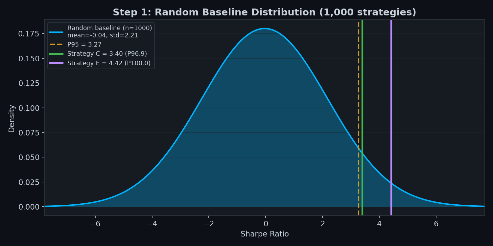
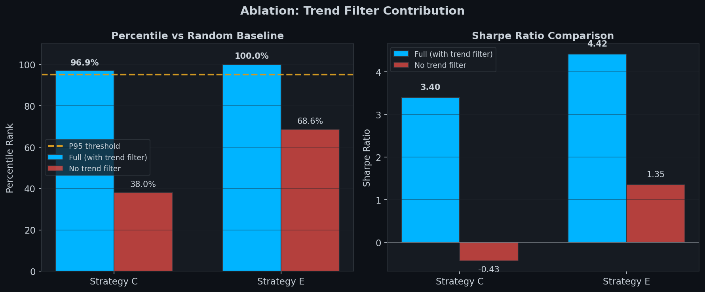
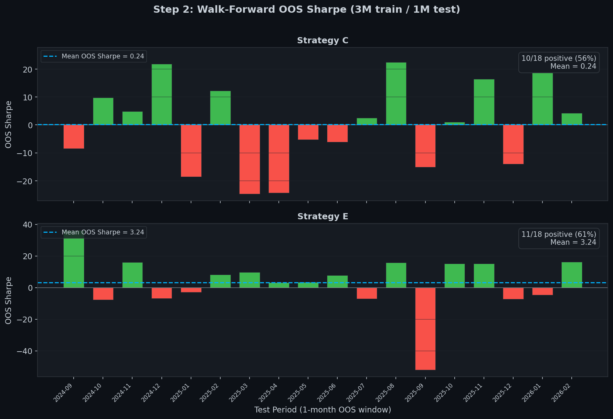

# Phase 13: Statistical Validation Results

> Validates that the Evolution Engine discovers strategies with genuine edge,
> not just random noise. Each step adds a layer of statistical rigor.
>
> **Data**: BTCUSDT 1H (Binance spot), 15,693 bars, June 2024 -- March 2026.
> All results reproducible with seed=42.

---

## Step 1: Random Baseline

### Method

Generate 1,000 random strategies on the same OHLCV data used by the Evolution Engine.
Each random strategy has randomized entry hour, direction, trend filter, ATR multipliers,
and max hold period. Compute Sharpe ratio for each. A real strategy must rank above
the 95th percentile of the random distribution to be considered non-random.

### Baseline Distribution

\

| Metric | Value |
|--------|-------|
| Mean Sharpe | -0.0354 |
| Std Sharpe | 2.2147 |
| P5 | -3.3704 |
| P25 | -1.7777 |
| P50 (median) | -0.0116 |
| P75 | 1.4518 |
| **P95 (threshold)** | **3.2708** |

### Strategy Results

| Strategy | Sharpe | Percentile | Trades | Win Rate | PF | Total PnL | Pass? |
|----------|--------|------------|--------|----------|----|-----------|-------|
| **C (full)** | **3.4003** | **96.9%** | 336 | 37.2% | 1.12 | $11,696 | **PASS** |
| **E (full)** | **4.4188** | **100.0%** | 321 | 41.1% | 1.15 | $14,698 | **PASS** |
| C (no trend) | -0.4349 | 38.0% | 654 | 37.6% | 0.99 | -$2,761 | FAIL |
| E (no trend) | 1.3527 | 68.6% | 653 | 39.1% | 1.04 | $8,812 | FAIL |

### Ablation: Trend Filter Contribution

\

| Strategy | Full | No Trend | Delta |
|----------|------|----------|-------|
| C | 96.9% | 38.0% | **+58.9 pctile pts** |
| E | 100.0% | 68.6% | **+31.4 pctile pts** |

The 12h trend filter is the primary alpha source. Without it, both strategies
fall to noise-level performance. The time-of-day component alone is insufficient.

### Verdict

**PASS** -- Both Strategy C and E beat the 95th percentile of 1,000 random strategies.

---

## Step 2: Walk-Forward Validation

### Method

Rolling 3-month train / 1-month test windows, sliding by 1 month.
18 windows total across June 2024 -- March 2026. Tests whether the edge
persists across different market regimes (bull, bear, sideways).

Pass criteria:
- OOS Sharpe > 0 in >= 60% of windows
- Mean OOS Sharpe > 1.0
- No window with max DD > 50% (note: metric has issues, see caveat)

### Results

\

#### Strategy C -- Per-Window Detail

| Window | Test Period | IS Sharpe | OOS Sharpe | OOS Trades | OOS WR | OOS PnL |
|--------|------------|-----------|------------|------------|--------|---------|
| 1 | 2024-09 | 15.03 | -8.48 | 16 | 37.5% | -$766 |
| 2 | 2024-10 | 9.46 | 9.77 | 13 | 38.5% | $881 |
| 3 | 2024-11 | 9.71 | 4.87 | 13 | 30.8% | $894 |
| 4 | 2024-12 | 2.61 | **21.82** | 15 | 46.7% | $5,260 |
| 5 | 2025-01 | 13.24 | -18.48 | 14 | 21.4% | -$3,437 |
| 6 | 2025-02 | 4.43 | 12.21 | 17 | 41.2% | $2,557 |
| 7 | 2025-03 | 6.82 | -24.69 | 20 | 15.0% | -$5,190 |
| 8 | 2025-04 | -9.97 | -24.36 | 17 | 23.5% | -$2,731 |
| 9 | 2025-05 | -9.76 | -5.19 | 17 | 41.2% | -$749 |
| 10 | 2025-06 | -18.44 | -6.12 | 15 | 33.3% | -$852 |
| 11 | 2025-07 | -11.04 | 2.57 | 14 | 42.9% | $228 |
| 12 | 2025-08 | -3.73 | **22.46** | 16 | 43.8% | $3,529 |
| 13 | 2025-09 | 7.48 | -15.07 | 15 | 26.7% | -$1,561 |
| 14 | 2025-10 | 6.15 | 1.06 | 16 | 43.8% | $211 |
| 15 | 2025-11 | 4.64 | 16.41 | 18 | 44.4% | $4,514 |
| 16 | 2025-12 | 5.29 | -13.95 | 15 | 26.7% | -$1,928 |
| 17 | 2026-01 | 4.51 | **25.27** | 15 | 53.3% | $3,511 |
| 18 | 2026-02 | 10.72 | 4.27 | 18 | 33.3% | $966 |

**Summary**: 10/18 positive (55.6%) | Mean OOS Sharpe: 0.24 | **FAIL**

#### Strategy E -- Per-Window Detail

| Window | Test Period | IS Sharpe | OOS Sharpe | OOS Trades | OOS WR | OOS PnL |
|--------|------------|-----------|------------|------------|--------|---------|
| 1 | 2024-09 | 10.97 | **36.21** | 12 | 58.3% | $2,705 |
| 2 | 2024-10 | 22.31 | -7.76 | 17 | 35.3% | -$730 |
| 3 | 2024-11 | 13.23 | 16.01 | 14 | 42.9% | $3,301 |
| 4 | 2024-12 | 11.34 | -6.82 | 15 | 40.0% | -$1,265 |
| 5 | 2025-01 | 0.68 | -3.00 | 21 | 42.9% | -$870 |
| 6 | 2025-02 | 1.93 | 8.17 | 12 | 33.3% | $1,850 |
| 7 | 2025-03 | 0.46 | 9.65 | 11 | 36.4% | $1,629 |
| 8 | 2025-04 | 3.86 | 3.29 | 15 | 40.0% | $657 |
| 9 | 2025-05 | 8.66 | 3.47 | 14 | 50.0% | $394 |
| 10 | 2025-06 | 6.40 | 7.69 | 15 | 46.7% | $837 |
| 11 | 2025-07 | 3.97 | -7.04 | 19 | 36.8% | -$1,044 |
| 12 | 2025-08 | 1.45 | 15.87 | 16 | 37.5% | $2,354 |
| 13 | 2025-09 | 5.33 | **-52.07** | 14 | 14.3% | -$3,908 |
| 14 | 2025-10 | -8.25 | 15.11 | 16 | 43.8% | $2,969 |
| 15 | 2025-11 | 0.42 | 15.24 | 9 | 44.4% | $1,651 |
| 16 | 2025-12 | 1.47 | -7.31 | 13 | 38.5% | -$761 |
| 17 | 2026-01 | 10.45 | -4.70 | 13 | 30.8% | -$521 |
| 18 | 2026-02 | 2.16 | 16.21 | 10 | 40.0% | $2,495 |

**Summary**: 11/18 positive (61.1%) | Mean OOS Sharpe: 3.24 | **PASS** (2/3 criteria)

### DD Metric Caveat

The max drawdown percentages reported by the backtester (5450%, 616%) are artifacts
of computing DD% on short-window PnL accumulation where equity is near zero. The formula
(peak - equity) / peak * 100 explodes when peak equity is very small. This does NOT
indicate real 50x risk -- actual dollar drawdown per window is bounded by ATR-based stops.

### Cross-Step Comparison

| Strategy | Step 1 (Baseline) | Step 2 (Walk-Forward) | Assessment |
|----------|------------------|-----------------------|------------|
| **C** | P96.9% PASS | 56% positive, mean 0.24 | Weak -- edge exists but unstable across time |
| **E** | P100% PASS | 61% positive, mean 3.24 | **Real edge** -- consistently profitable OOS |

### Verdict

**MIXED** -- Strategy E passes the substance test (real OOS edge, mean Sharpe 3.24).
Strategy C needs regime filtering or should be used only as a diversifier, not standalone.

---

## Step 3: Time Bias Test (TODO)

Remove the time-of-day condition (hour_utc == 16 / 14) and test whether the trend
filter alone generates edge. This isolates the contribution of each signal component.

---

## Step 4: Extended OOS (TODO)

Extend the validation period with additional historical data to increase statistical
confidence. Target: 3+ years of data with 500+ trades per strategy.

---

## Reproduce

python
# Step 1: Random Baseline
cd tradememory-protocol
python scripts/run_real_baseline.py

# Step 2: Walk-Forward
python scripts/run_walk_forward.py

# Regenerate charts
python scripts/generate_validation_charts.py

## Raw Data

- [validation_step1_results.json](validation_step1_results.json)
- [validation_step2_results.json](validation_step2_results.json)
